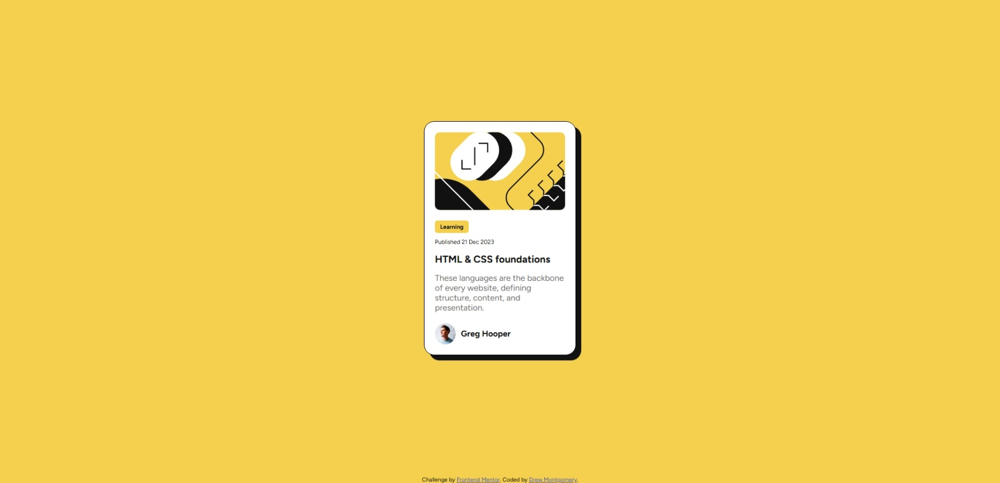

# Frontend Mentor - Blog preview card solution

This is a solution to the [Blog preview card challenge on Frontend Mentor](https://www.frontendmentor.io/challenges/blog-preview-card-ckPaj01IcS). Frontend Mentor challenges help you improve your coding skills by building realistic projects. 

## Table of contents

- [Overview](#overview)
  - [The challenge](#the-challenge)
  - [Screenshot](#screenshot)
  - [Links](#links)
- [My process](#my-process)
  - [Built with](#built-with)
  - [What I learned](#what-i-learned)
  - [Continued development](#continued-development)
  - [Useful resources](#useful-resources)
- [Author](#author)

**Note: Delete this note and update the table of contents based on what sections you keep.**

## Overview

### The challenge

Users should be able to:

- See hover and focus states for all interactive elements on the page

### Screenshot

### Links

- Solution URL: [GitHub repo](https://github.com/DrewM64/blog-preview-card)
- Live Site URL: [GitHub Pages](https://drewm64.github.io/blog-preview-card/)

## My process

### Built with

- Semantic HTML5 markup
- CSS custom properties
- Flexbox
- CSS Grid
- Mobile-first workflow

### What I learned

I used the same block of code for centering the elemennts on the page using CSS Grid as I used in the last project. It seems pretty versatile. 

I also used Flexbox for the layout of the elements on the card. It was useful for separating the rows of text and getting the user's avatar next to their name in a way that felt intuitive.

For getting the text to be a bit responsive, I used the clamp() function in the .card element to resize the text based on the size of the viewport. For larger or smaller text, I used em units instead of px. It's much more fluid compared to using media queries.

### Continued development

I'll practice more with using CSS Grid and Flexbox, as well as incorporating the clamp() and calc() functions for responsive layouts. 

### Useful resources

- [CSS Grid layout guide](https://css-tricks.com/snippets/css/complete-guide-grid/)
- [CSS Flexbox layout guide](https://css-tricks.com/snippets/css/a-guide-to-flexbox/)

Two great pages to have bookmarked. My go-to for understanding and implementing layout changes using Grid and Flexbox.

## Author

- GitHub - [DrewM64](https://github.com/DrewM64)
- Frontend Mentor - [@DrewM64](https://www.frontendmentor.io/profile/DrewM64)
